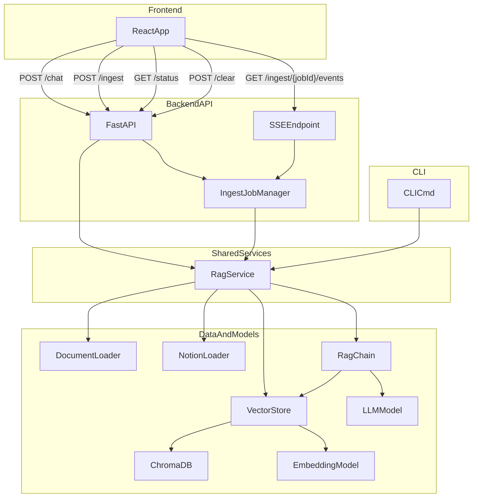

# RAG Agent

RAG (Retrieval-Augmented Generation) project with three interfaces over the same backend logic:
- CLI (`uv run rag ...`)
- FastAPI server (`uv run rag-api`)
- React + TypeScript + Tailwind UI (`frontend/`)

## Architecture



## Prerequisites

1. **Python 3.10+**
2. **uv** package manager
3. **Ollama** installed and running: https://ollama.ai
4. **Node.js 18+** (for frontend)

## Installation

Install backend dependencies:

```bash
uv sync
```

Install frontend dependencies:

```bash
cd frontend
npm install
```

## CLI Usage

### Ingest documents

```bash
uv run rag ingest
uv run rag ingest --source local
uv run rag ingest --source notion
```

### Query documents

```bash
uv run rag query "What powers does Congress have?"
uv run rag query "What is the role of the President?" --show-sources
```

### Status and clear

```bash
uv run rag status
uv run rag clear
```

## API Usage

Run API server:

```bash
uv run rag-api
```

Endpoints:
- `GET /health`
- `GET /status`
- `POST /clear`
- `POST /chat`
- `POST /ingest` (starts async ingestion job)
- `GET /ingest/{job_id}` (job snapshot)
- `GET /ingest/{job_id}/events` (SSE progress stream)

### Ingestion flow

1. `POST /ingest` with `{"source":"all"|"local"|"notion"}`.
2. Receive `job_id`.
3. Subscribe to `GET /ingest/{job_id}/events`.
4. Update UI progress bar from SSE event payload (`status`, `progress`, `stage`, `message`).

## Frontend Usage

```bash
cd frontend
npm run dev
```

Set API URL (optional):

```bash
# frontend/.env
VITE_API_BASE_URL=http://127.0.0.1:8001
```

## Notion Integration

To ingest from Notion, create `.env` in the project root:

```bash
NOTION_TOKEN=secret_xxxxxxxxxxxxxxxxxxxxxxxxxxxxxxxxxxxxxxxxxx
NOTION_DATABASE_ID=xxxxxxxx-xxxx-xxxx-xxxx-xxxxxxxxxxxx
```

Then share your target Notion database with your integration.

## Configuration

Edit `src/config.py`:
- `EMBEDDING_MODEL`
- `EMBEDDING_DEVICE` (examples: `cuda:0`, `cuda:1`, `cpu`)
- `LLM_MODEL`
- `CHUNK_SIZE`
- `CHUNK_OVERLAP`
- `TOP_K_RESULTS`
