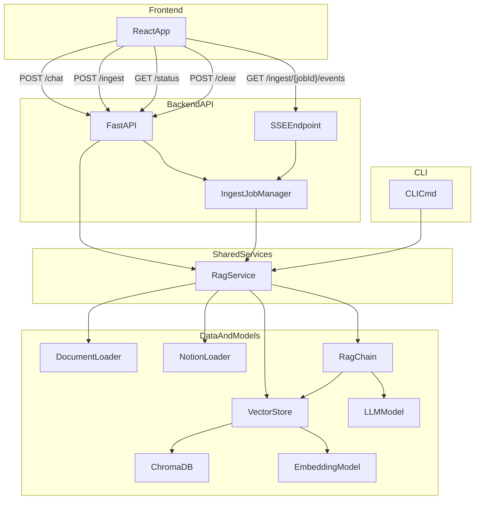

# RAG Agent

RAG (Retrieval-Augmented Generation) project with three interfaces over the same backend logic:
- CLI (`uv run rag ...`)
- FastAPI server (`uv run rag-api`)
- React + TypeScript + Tailwind UI (`frontend/`)

## Architecture


```mermaid
flowchart TD
  subgraph uiLayer [Frontend]
    reactApp[ReactApp]
  end

  subgraph apiLayer [BackendAPI]
    fastApi[FastAPI]
    ingestManager[IngestJobManager]
    sseEndpoint[SSEEndpoint]
  end

  subgraph serviceLayer [SharedServices]
    ragService[RagService]
  end

  subgraph dataLayer [DataAndModels]
    localLoader[DocumentLoader]
    notionLoader[NotionLoader]
    vectorStore[VectorStore]
    ragChain[RagChain]
    chromaDb[ChromaDB]
    llmModel[LLMModel]
    embedModel[EmbeddingModel]
  end

  subgraph cliLayer [CLI]
    cliCmd[CLICmd]
  end

  reactApp -->|"POST /chat"| fastApi
  reactApp -->|"POST /ingest"| fastApi
  reactApp -->|"GET /ingest/{jobId}/events"| sseEndpoint
  reactApp -->|"GET /status"| fastApi
  reactApp -->|"POST /clear"| fastApi

  fastApi --> ragService
  fastApi --> ingestManager
  sseEndpoint --> ingestManager
  ingestManager --> ragService

  ragService --> localLoader
  ragService --> notionLoader
  ragService --> vectorStore
  ragService --> ragChain

  vectorStore --> chromaDb
  vectorStore --> embedModel
  ragChain --> llmModel
  ragChain --> vectorStore

  cliCmd --> ragService
```

## Prerequisites

1. **Python 3.10+**
2. **uv** package manager
3. **llama-cpp-python** via `uv sync` (default wheel is **CPU-only**). On Windows with an NVIDIA GPU, run `.\scripts\install_llamacpp_cuda_windows.ps1` after sync for CUDA offload (needs CUDA toolkit + MSVC — see [LLM GPU acceleration](#llm-gpu-acceleration-llamacpp)).
4. **Node.js 18+** (for frontend)

## Installation

Install backend dependencies:

```bash
uv sync
```

Install frontend dependencies:

```bash
cd frontend
npm install
```

## CLI Usage

### Ingest documents

```bash
uv run rag ingest
uv run rag ingest --source local
uv run rag ingest --source notion
```

### Query documents

```bash
uv run rag query "What powers does Congress have?"
uv run rag query "What is the role of the President?" --show-sources
```

### Status and clear

```bash
uv run rag status
uv run rag clear
```

## API Usage

Run API server:

```bash
uv run rag-api
```

Endpoints:
- `GET /health`
- `GET /status`
- `POST /clear`
- `POST /chat`
- `POST /ingest` (starts async ingestion job)
- `GET /ingest/{job_id}` (job snapshot)
- `GET /ingest/{job_id}/events` (SSE progress stream)

### Ingestion flow

1. `POST /ingest` with `{"source":"all"|"local"|"notion"}`.
2. Receive `job_id`.
3. Subscribe to `GET /ingest/{job_id}/events`.
4. Update UI progress bar from SSE event payload (`status`, `progress`, `stage`, `message`).

## Frontend Usage

```bash
cd frontend
npm run dev
```

Set API URL (optional):

```bash
# frontend/.env
VITE_API_BASE_URL=http://127.0.0.1:8001
```

## Notion Integration

To ingest from Notion, create `.env` in the project root:

```bash
NOTION_TOKEN=secret_xxxxxxxxxxxxxxxxxxxxxxxxxxxxxxxxxxxxxxxxxx
NOTION_DATABASE_ID=xxxxxxxx-xxxx-xxxx-xxxx-xxxxxxxxxxxx
```

Then share your target Notion database with your integration.

## Configuration

Edit `src/config.py`:
- `EMBEDDING_MODEL`
- `EMBEDDING_DEVICE` (examples: `cuda:0`, `cuda:1`, `cpu`)
- `LLM_MODEL`
- `LLAMACPP_N_GPU_LAYERS`
- `LLAMACPP_N_CTX`
- `LLAMACPP_N_THREADS`
- `LLAMACPP_TEMPERATURE`
- `LLAMACPP_VERBOSE`
- `CHUNK_SIZE`
- `CHUNK_OVERLAP`
- `TOP_K_RESULTS`
- `SUPPORTED_EXTENSIONS` (now includes image files like `.png`, `.jpg`, `.jpeg`, `.webp`, `.tiff`)
- `VISION_ENABLED`
- `VISION_CAPTION_PROVIDER`
- `VISION_CAPTION_MODEL`
- `VISION_MMPROJ_MODEL`
- `VISION_MAX_IMAGES_PER_DOC`
- `OCR_ENABLED`

## LLM GPU acceleration (llama.cpp)

PyTorch CUDA (`torch==...+cu124`) only affects **embeddings**. The **chat LLM** uses a separate native library: `llama-cpp-python`. The default wheel you get from a plain `uv sync` / `pip install` is often **CPU-only** (`llama_supports_gpu_offload()` is `false`), so `LLAMACPP_N_GPU_LAYERS` is ignored and you will see **no GPU usage** during `/chat`.

- **Check:** `uv run python -c "import llama_cpp; print(llama_cpp.llama_supports_gpu_offload())"` — expect `True` for GPU offload.
- **API / CLI:** `GET /status` and `rag status` include `llamacpp_gpu_offload` and `llamacpp_n_gpu_layers`.

**Windows (recommended):** from the repo root, with CUDA toolkit + MSVC build tools installed:

```powershell
.\scripts\install_llamacpp_cuda_windows.ps1
```

That sets `FORCE_CMAKE` and `CMAKE_ARGS=-DGGML_CUDA=ON`, then reinstalls `llama-cpp-python` from source against your CUDA toolkit.

**Manual one-liner (same effect):**

```powershell
$env:FORCE_CMAKE = "1"
$env:CMAKE_ARGS = "-DGGML_CUDA=ON"
uv pip install --force-reinstall --no-cache-dir llama-cpp-python
```

If CMake still skips GPU, try `-DLLAMA_CUDA=ON` instead (older CMake layouts). Prefer running from **Developer PowerShell for VS** so MSVC and SDK are on `PATH`. If `nvcc` hits **unsupported Microsoft Visual Studio version** (common when CUDA <= 12.1 sees VS 2025/2026), install **Build Tools for Visual Studio 2022** (MSVC **v143**, C++ workload) so `scripts/install_llamacpp_cuda_windows.ps1` can pick the **17.x** toolchain, or upgrade CUDA to a release that supports your MSVC. The script also appends `-allow-unsupported-compiler`, which helps some setups but not CMake’s CUDA compiler detection with a too-new host compiler.

**Important:** another plain `uv sync` can reinstall the **CPU** wheel from PyPI and reset `llama_supports_gpu_offload()` to `False`. Run the script again after that.

**Linux:** use the same `FORCE_CMAKE` / `CMAKE_ARGS` env vars with `uv pip install --force-reinstall --no-cache-dir llama-cpp-python`, or install a CUDA-enabled wheel from a published index if your platform provides one — see [llama-cpp-python](https://github.com/abetlen/llama-cpp-python/blob/main/README.md).

## Multimodal Ingestion

Local ingestion now supports text + visual processing for:
- PDF text and embedded images
- PPTX text and slide images
- Standalone image files (`.png`, `.jpg`, `.jpeg`, `.webp`, `.tiff`)

When vision is enabled, extracted images are captioned and the captions are embedded as additional retrievable chunks.

Example `.env` settings:

```bash
VISION_ENABLED=true
VISION_CAPTION_PROVIDER=llamacpp
VISION_CAPTION_MODEL=mys/ggml_llava-v1.5-7b/ggml-model-q5_k.gguf
VISION_MMPROJ_MODEL=mys/ggml_llava-v1.5-7b/mmproj-model-f16.gguf
VISION_MAX_IMAGES_PER_DOC=16

# Optional OCR extraction to append visible text from images
OCR_ENABLED=false
```

llama.cpp model configuration examples:

```bash
# local GGUF file under models/
LLM_MODEL=models/gpt-oss-20b-Q4_K_M.gguf

# or auto-download from HuggingFace to models/
LLM_MODEL=unsloth/gpt-oss-20b-GGUF/gpt-oss-20b-Q4_K_M.gguf

LLAMACPP_N_GPU_LAYERS=-1
LLAMACPP_N_CTX=4096
LLAMACPP_N_THREADS=16
LLAMACPP_TEMPERATURE=0.1
LLAMACPP_VERBOSE=false
```

Caption-derived chunks include metadata such as:
- `modality=image_caption`
- `page_or_slide`
- `image_mime`
- `parent_source`
- `caption_model`

## GPU Memory Tuning

For query-time CUDA OOM issues, set these in your project `.env`:

```bash
# Keep embedding on GPU
EMBEDDING_DEVICE=cuda:0

# Start balanced; lower if memory pressure continues
EMBEDDING_BATCH_SIZE=24
EMBEDDING_OOM_RETRY_BATCH_SIZE=8

# Keep vector quality and speed defaults
EMBEDDING_NORMALIZE=true

# Keep disabled for speed-first profile (enable only if needed)
EMBEDDING_OOM_CPU_FALLBACK=false

# Recommended by PyTorch to reduce fragmentation
PYTORCH_CUDA_ALLOC_CONF=expandable_segments:True
```

If OOM persists:
- Lower `EMBEDDING_BATCH_SIZE` to `16` or `8`.
- Keep `EMBEDDING_OOM_RETRY_BATCH_SIZE` at `4` or `8`.
- Enable `EMBEDDING_OOM_CPU_FALLBACK=true` only if stability is more important than speed.

Validation checklist:
- Run repeated `/chat` requests and confirm no progressive VRAM growth.
- Run `/ingest` while sending `/chat` requests and confirm no CUDA OOM.
- Confirm latency remains acceptable after batch-size tuning.
